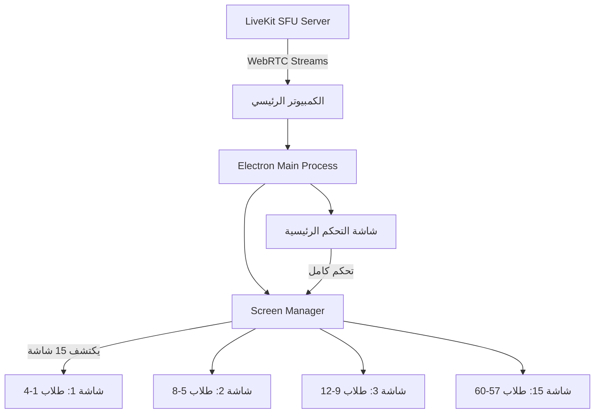

# Sovereign Multi-Screen Classroom Architecture

## المشكلة
معلم واحد يريد مراقبة 60+ طالب عبر **15 شاشة عادية** (HDMI/VGA) متصلة بـ **كمبيوتر واحد قوي** في القاعة.

---

## الحل المقترح: Electron + Multi-Window

### لماذا Electron؟
- **تحكم كامل بالشاشات**: يكتشف كل الشاشات المتصلة تلقائياً
- **نافذة لكل شاشة**: يفتح نافذة ملء الشاشة على كل مونيتور
- **لا يحتاج متصفح**: تطبيق مستقل يعمل بضغطة واحدة
- **نفس كود React الحالي**: يشغل الـ wall-client الموجود أصلاً

---

## الهيكل المعماري



---

## الأجهزة المطلوبة (Hardware)

### توصيل 15 شاشة بجهاز واحد

| الخيار | الطريقة | التكلفة | التوصية |
|--------|---------|---------|---------|
| **Option A** ✅ | 4× GPU رخيصة (كل واحدة 4 مخارج) | ~$400 | **الأفضل للأداء** |
| **Option B** | USB 3.0 → HDMI Adapters (DisplayLink) | ~$300 | مقبول لعرض الفيديو |
| **Option C** | 2× GPU + بعض USB Adapters | ~$250 | حل وسط عملي |

### مثال عملي (Option A):
```
GPU 1 (NVIDIA GT 1030): شاشات 1-4
GPU 2 (NVIDIA GT 1030): شاشات 5-8  
GPU 3 (NVIDIA GT 1030): شاشات 9-12
GPU 4 (NVIDIA GT 1030): شاشات 13-15 + شاشة التحكم
```

### مواصفات الكمبيوتر المطلوبة:
| المكون | الحد الأدنى |
|--------|------------|
| CPU | Intel i7-12700 أو AMD Ryzen 7 |
| RAM | 32 GB |
| GPU | 4× بطاقات بـ 4 مخارج |
| Network | Ethernet 1Gbps |
| Motherboard | ATX مع 4+ PCIe slots |

---

## البرمجيات (Software Architecture)

### الملفات الجديدة المطلوبة:

#### [NEW] `sovereign-desktop/main.js` — Electron Main Process
```javascript
const { app, BrowserWindow, screen } = require('electron');

let controlWindow = null;
let displayWindows = [];

app.whenReady().then(() => {
  const displays = screen.getAllDisplays();
  const primary = screen.getPrimaryDisplay();
  const secondaryDisplays = displays.filter(d => d.id !== primary.id);
  
  const totalStudents = 60; // يأتي من API
  const studentsPerScreen = Math.ceil(totalStudents / secondaryDisplays.length);

  // 1. نافذة التحكم الرئيسية (للمعلم)
  controlWindow = new BrowserWindow({
    x: primary.bounds.x,
    y: primary.bounds.y,
    fullscreen: true,
    webPreferences: { nodeIntegration: false, contextIsolation: true }
  });
  controlWindow.loadURL('https://wall.60sec.shop/control');

  // 2. نافذة لكل شاشة عرض
  secondaryDisplays.forEach((display, index) => {
    const startIndex = index * studentsPerScreen;
    const endIndex = startIndex + studentsPerScreen;
    
    const win = new BrowserWindow({
      x: display.bounds.x,
      y: display.bounds.y,
      fullscreen: true,
      frame: false,
      webPreferences: { nodeIntegration: false, contextIsolation: true }
    });
    
    win.loadURL(`https://wall.60sec.shop/grid/${index}?start=${startIndex}&count=${studentsPerScreen}`);
    displayWindows.push(win);
  });
});
```

#### [NEW] `wall-client/src/pages/GridPage.tsx` — صفحة عرض الطلاب
```tsx
// صفحة مخصصة لكل شاشة: تعرض فقط مجموعة من الطلاب
// URL: /grid/:screenIndex?start=0&count=4
// تعرض شبكة 2x2 من فيديوهات الطلاب
```

#### [MODIFY] `wall-client/src/App.tsx` — إضافة Route جديد
```tsx
// إضافة مسار /grid/:screenIndex للشاشات الثانوية
// إضافة مسار /control للوحة التحكم الرئيسية
```

---

## حساب الأداء (Performance Budget)

```
60 طالب × 360p video stream = ~120 Mbps bandwidth
60 طالب × 15 MB RAM per stream = ~900 MB RAM for video
15 نافذة Electron × 100 MB each = ~1.5 GB RAM

المجموع المتوقع: ~4 GB RAM + ~120 Mbps network
✅ مناسب جداً لجهاز بـ 32 GB RAM و Ethernet 1Gbps
```

---

## خطة التنفيذ

### المرحلة 1: إثبات المفهوم (3 أيام)
- [ ] إنشاء مشروع Electron بسيط يفتح نوافذ على كل الشاشات
- [ ] إنشاء صفحة `/grid/:id` تعرض 4 طلاب فقط
- [ ] اختبار مع 2-3 شاشات

### المرحلة 2: التكامل (5 أيام)
- [ ] ربط الـ Grid Page بـ LiveKit لاستقبال الفيديو
- [ ] نظام التوزيع التلقائي (عدد الطلاب ÷ عدد الشاشات)
- [ ] إعادة التوزيع عند دخول/خروج طالب

### المرحلة 3: التلميع (3 أيام)
- [ ] Auto-start: يعمل تلقائياً عند تشغيل الكمبيوتر
- [ ] Health monitoring لكل شاشة
- [ ] إعادة اتصال تلقائية عند فقد الاتصال

---

## بديل أبسط (بدون Electron)

> [!TIP]
> إذا أردت حلاً أسرع بدون Electron، يمكنك استخدام **Chrome Kiosk Mode**:

```powershell
# سكريبت PowerShell يفتح 15 نافذة Chrome على 15 شاشة
$displays = Get-CimInstance Win32_DesktopMonitor
$i = 0
foreach ($d in $displays) {
    Start-Process chrome "--kiosk --new-window https://wall.60sec.shop/grid/$i --window-position=$($d.Left),$($d.Top)"
    $i++
}
```

هذا الحل **أسرع في التنفيذ** لكن أقل تحكماً من Electron.

---

## Open Questions

> [!IMPORTANT]
> 1. **كم طالب متوقع في الحصة الواحدة؟** (يحدد عدد الفيديوهات لكل شاشة)
> 2. **هل المعلم يحتاج تحكم من شاشة مخصصة؟** (Mute/Kick) أم فقط مراقبة؟
> 3. **هل تريد البدء بحل Chrome السريع أم Electron الكامل؟**
