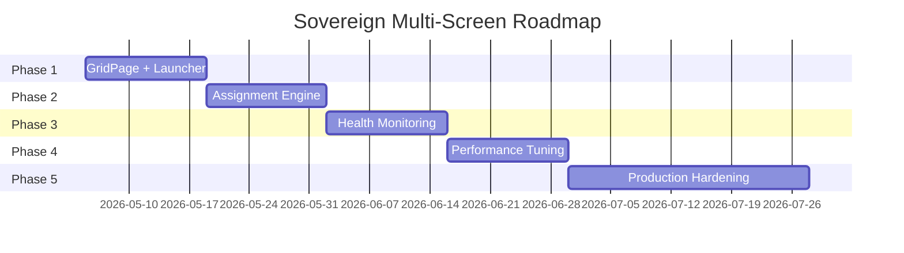

# Sovereign Multi-Screen Classroom — Execution Roadmap
## تحليل الوضع الحالي مقابل الخطة المعمارية المستهدفة

---

## ✅ ما تم إنجازه فعلاً (Current State)

| المكون | الحالة | التفاصيل |
|--------|--------|----------|
| Backend API (Node.js + Express) | ✅ يعمل | Auth, Lectures CRUD, JWT, Error Handling |
| MongoDB Atlas | ✅ متصل | User + Lecture models |
| LiveKit Token Service | ✅ يعمل | Token generation مع role-based permissions |
| Socket.io Signaling | ✅ يعمل | Mute/Unmute/Kick/Join Room events |
| Teacher Dashboard (wall-client) | ✅ يعمل | Single-screen grid, pagination, controls |
| Student Portal (student-client) | ✅ يعمل | Cinema view, auto-mute, kick detection |
| ParticipantGrid Component | ✅ يعمل | Dynamic grid layout (sqrt-based) |
| VideoTrack Component | ✅ يعمل | WebRTC track rendering |
| Nginx Reverse Proxy | ✅ يعمل | api/meet/wall subdomains, WebSocket proxy |
| PM2 Process Management | ✅ يعمل | 3 processes: backend, student, wall |
| Cloudflare DNS + HTTPS | ✅ يعمل | SSL termination |
| Docker Compose | ✅ موجود | Not actively used (PM2 instead) |
| Security Layer | ✅ يعمل | bfcache protection, track cleanup, right-click block |

---

## ❌ ما ينقص (Gap Analysis vs Engineer's Plan)

| المكون المطلوب | الحالة | الأولوية |
|---------------|--------|----------|
| **Multi-Display Grid Page** | 🟡 بدأ (GridPage.tsx created) | P0 — Critical |
| **Screen Launcher / Orchestrator** | ❌ غير موجود | P0 — Critical |
| **Display Assignment Algorithm** | ❌ غير موجود | P0 — Critical |
| **Room Orchestrator Service** | ❌ غير موجود | P1 — High |
| **Display Health Monitoring** | ❌ غير موجود | P1 — High |
| **Heartbeat System** | ❌ غير موجود | P1 — High |
| **Redis State Management** | ❌ غير موجود | P2 — Medium |
| **LiveKit SFU Self-Hosted** | ⏸️ مؤجل (انظر ملف 14) | P4 — Deferred |
| **Electron Desktop App** | ❌ غير موجود | P2 — Medium |
| **VLAN Network Isolation** | ❌ غير موجود | P3 — Future |
| **Simulcast Quality Layers** | 🟡 جزئي (Quality toggle exists) | P2 — Medium |
| **Recording & Playback** | ❌ غير موجود | P3 — Future |
| **Analytics Dashboard** | ❌ غير موجود | P3 — Future |

---

## خطة التنفيذ المفصلة (5 مراحل)

---

### 🔵 المرحلة 1: Multi-Display Core (الأسبوع 1-2)
**الهدف:** جعل المنصة قادرة على عرض الطلاب على شاشات متعددة من جهاز واحد

#### 1.1 إكمال GridPage Component
- [x] إنشاء `GridPage.tsx` (تم)
- [ ] إضافة Route `/grid` في `App.tsx`
- [ ] دعم URL params: `?lecture=ID&start=0&count=4&screen=1`
- [ ] عرض الطلاب بدون أزرار تحكم (Display-Only Mode)
- [ ] Fullscreen تلقائي عند فتح الصفحة
- [ ] إخفاء cursor بعد 3 ثواني

#### 1.2 Screen Launcher Page
- [ ] إنشاء `ScreenLauncher.tsx` — صفحة تحكم مركزية
- [ ] إضافة Route `/launcher` في `App.tsx`
- [ ] واجهة لإدخال: Lecture ID + عدد الشاشات
- [ ] زر "Launch All Screens" يفتح نوافذ متعددة
- [ ] كل نافذة تفتح `/grid?lecture=ID&start=X&count=Y&screen=N`
- [ ] حساب تلقائي: `studentsPerScreen = ceil(totalStudents / numberOfScreens)`

#### 1.3 PowerShell Auto-Launcher
- [ ] إنشاء `launch-screens.ps1` سكريبت
- [ ] يفتح 15 نافذة Chrome في وضع `--kiosk`
- [ ] كل نافذة على شاشة مختلفة (باستخدام `--window-position`)
- [ ] يعمل تلقائياً عند تشغيل الجهاز (Startup Task)

#### اختبارات المرحلة 1:
```
TEST-1.1: فتح /grid?lecture=TEST&start=0&count=4&screen=0 → يعرض 4 طلاب
TEST-1.2: فتح 3 نوافذ مختلفة بـ start مختلف → كل نافذة تعرض مجموعة مختلفة
TEST-1.3: طالب جديد يدخل → يظهر في الشاشة الصحيحة تلقائياً
TEST-1.4: تشغيل PowerShell script → يفتح 15 نافذة على شاشات مختلفة
```

---

### 🟢 المرحلة 2: Display Assignment Engine (الأسبوع 3-4)
**الهدف:** توزيع ذكي وتلقائي للطلاب على الشاشات

#### 2.1 Backend: Room Orchestrator Service
- [ ] إنشاء `display.service.ts` — خدمة إدارة الشاشات
- [ ] إنشاء `Display` model في MongoDB:
  ```
  { hardware_id, room_id, display_index, ip_address, 
    status: online|offline, assigned_students: [], last_heartbeat }
  ```
- [ ] API: `POST /api/displays/register` — تسجيل شاشة جديدة
- [ ] API: `GET /api/displays/:lectureId/assignment` — جلب توزيع الطلاب
- [ ] API: `POST /api/displays/:lectureId/rebalance` — إعادة التوزيع

#### 2.2 Dynamic Rebalancing Algorithm
- [ ] عند دخول طالب جديد → إعادة حساب التوزيع
- [ ] عند خروج طالب → نقل آخر طالب لملء الفراغ
- [ ] Socket event: `display:rebalance` → كل شاشة تحدث نفسها
- [ ] الخوارزمية: Round-Robin مع مراعاة التوازن

#### 2.3 GridPage Enhancement
- [ ] بدلاً من URL params ثابتة → الشاشة تسجل نفسها وتستلم التوزيع من API
- [ ] الاستماع لحدث `display:rebalance` لتحديث الطلاب المعروضين
- [ ] عرض رقم الشاشة وعدد الطلاب كـ overlay

#### اختبارات المرحلة 2:
```
TEST-2.1: 60 طالب + 15 شاشة → كل شاشة تعرض 4 طلاب
TEST-2.2: طالب يخرج → الشاشة تُحدَّث تلقائياً خلال < 2 ثانية
TEST-2.3: شاشة تنقطع → الطلاب يُوزَّعون على الشاشات المتبقية
TEST-2.4: API /assignment يرجع JSON صحيح بالتوزيع
```

---

### 🟡 المرحلة 3: Health Monitoring & Reliability (الأسبوع 5-6)
**الهدف:** ضمان استقرار 24/7 مع اكتشاف الأعطال تلقائياً

#### 3.1 Heartbeat System
- [ ] كل GridPage ترسل heartbeat كل 5 ثواني عبر Socket.io
- [ ] Backend يتتبع آخر heartbeat لكل شاشة
- [ ] بعد 3 heartbeats مفقودة (15 ثانية) → حالة "offline"
- [ ] عند عودة الشاشة → إعادة تسجيل وتوزيع تلقائي

#### 3.2 Teacher Monitoring Dashboard
- [ ] إضافة قسم "Screen Status" في Teacher Dashboard
- [ ] عرض حالة كل شاشة (Online/Offline/Warning)
- [ ] عدد الطلاب على كل شاشة
- [ ] زر "Refresh Screen" لإجبار شاشة معينة على إعادة التحميل
- [ ] زر "Rebalance All" لإعادة توزيع كل الطلاب

#### 3.3 Auto-Recovery
- [ ] GridPage: إعادة اتصال تلقائية عند فقد الاتصال
- [ ] Exponential backoff: 1s → 2s → 4s → 8s → 16s → max 30s
- [ ] عرض "Reconnecting..." overlay أثناء إعادة الاتصال
- [ ] بعد 5 محاولات فاشلة → reload الصفحة بالكامل

#### اختبارات المرحلة 3:
```
TEST-3.1: فصل شبكة شاشة واحدة → Teacher Dashboard يظهر "Offline" خلال 15 ثانية
TEST-3.2: إعادة توصيل الشاشة → تعود "Online" وتستلم طلابها
TEST-3.3: فصل الإنترنت عن السيرفر 30 ثانية → كل الشاشات تعيد الاتصال تلقائياً
TEST-3.4: ضغط "Refresh Screen" → الشاشة المحددة تعيد التحميل
```

---

### 🟠 المرحلة 4: Performance & Optimization (الأسبوع 7-8)
**الهدف:** تحسين الأداء لدعم 200 طالب على 16 شاشة

#### 4.1 Simulcast Integration
- [ ] تعديل `livekit.service.ts` لتفعيل Simulcast في Token
- [ ] الطالب يرسل 3 جودات: Low (320p) + Medium (480p) + High (720p)
- [ ] GridPage تستقبل Medium quality فقط (توفير bandwidth)
- [ ] Teacher Dashboard يمكنه التبديل بين الجودات

#### 4.2 Selective Track Subscription
- [ ] كل GridPage تشترك فقط في tracks الطلاب المخصصين لها
- [ ] بدلاً من الاشتراك في كل الطلاب ثم تصفيتهم
- [ ] تقليل bandwidth من ~300 Mbps إلى ~50 Mbps لكل شاشة

#### 4.3 [تم التأجيل] LiveKit Self-Hosted
- [ ] تم نقل هذا المكون إلى المرحلة النهائية (Optimization) لضمان استقرار الكود أولاً.
- [ ] التفاصيل في الملف: [14-deferred-livekit-optimization.md](file:///C:/Users/Dell/Desktop/learn/meet-2/plan/14-deferred-livekit-optimization.md)

#### اختبارات المرحلة 4:
```
TEST-4.1: 50 طالب + 4 شاشات → CPU < 60% على كل Mini PC
TEST-4.2: Bandwidth لكل شاشة < 60 Mbps مع 12 طالب
TEST-4.3: تحويل الجودة من Medium → Low → جودة الفيديو تتغير فوراً
TEST-4.4: (إذا تم) LiveKit self-hosted يقبل 100 مشارك بدون أخطاء
```

---

### 🔴 المرحلة 5: Production Hardening (الأسبوع 9-12)
**الهدف:** تجهيز النظام للإنتاج الفعلي

#### 5.1 Electron Desktop App
- [ ] إنشاء مشروع Electron يغلف wall-client
- [ ] اكتشاف تلقائي لجميع الشاشات (`screen.getAllDisplays()`)
- [ ] فتح نافذة fullscreen على كل شاشة تلقائياً
- [ ] الشاشة الرئيسية = Teacher Dashboard
- [ ] باقي الشاشات = GridPage مع توزيع تلقائي
- [ ] Auto-start عند تشغيل Windows

#### 5.2 Network Security (VLAN)
- [ ] تصميم VLAN topology للقاعة
- [ ] QoS policies: أولوية للـ WebRTC traffic
- [ ] عزل كل قاعة في شبكة فرعية مستقلة

#### 5.3 Monitoring & Alerting
- [ ] لوحة Grafana لمتابعة: CPU, RAM, Bandwidth, Latency
- [ ] تنبيهات عبر Telegram/Email عند:
  - شاشة offline > 30 ثانية
  - Bandwidth > 80%
  - CPU > 90%
  - طالب منقطع > 60 ثانية

#### 5.4 Documentation & Training
- [ ] دليل تركيب Hardware (الشاشات + Mini PCs + الأسلاك)
- [ ] دليل إعداد Software (الأنظمة + البرامج + الإعدادات)
- [ ] دليل استخدام المعلم
- [ ] Troubleshooting Playbook

#### اختبارات المرحلة 5:
```
TEST-5.1: Electron app يفتح ويوزع على 3+ شاشات تلقائياً
TEST-5.2: قطع شبكة VLAN لقاعة A → قاعة B لا تتأثر
TEST-5.3: تنبيه Telegram يصل خلال 30 ثانية من انقطاع شاشة
TEST-5.4: معلم جديد يستطيع تشغيل النظام بعد قراءة الدليل
```

---

## ملخص الجدول الزمني



---

## Open Questions

> [!IMPORTANT]
> 1. **هل تريد البدء بالمرحلة 1 فوراً؟** (GridPage + PowerShell Launcher) — يمكن اختباره اليوم مع 2-3 شاشات
> 2. **هل ستستخدم Mini PCs منفصلة أم جهاز واحد مع Multi-GPU؟**
> 3. **كم طالب متوقع في الحصة الواحدة؟** (يحدد حجم Simulcast المطلوب)
> 4. **هل تحتاج Electron أم يكفي Chrome Kiosk كحل أولي؟**
